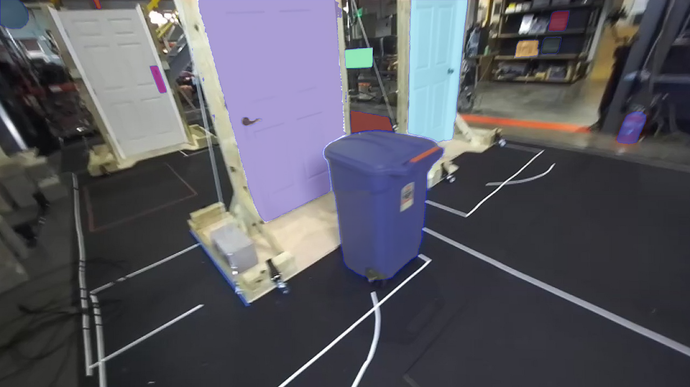
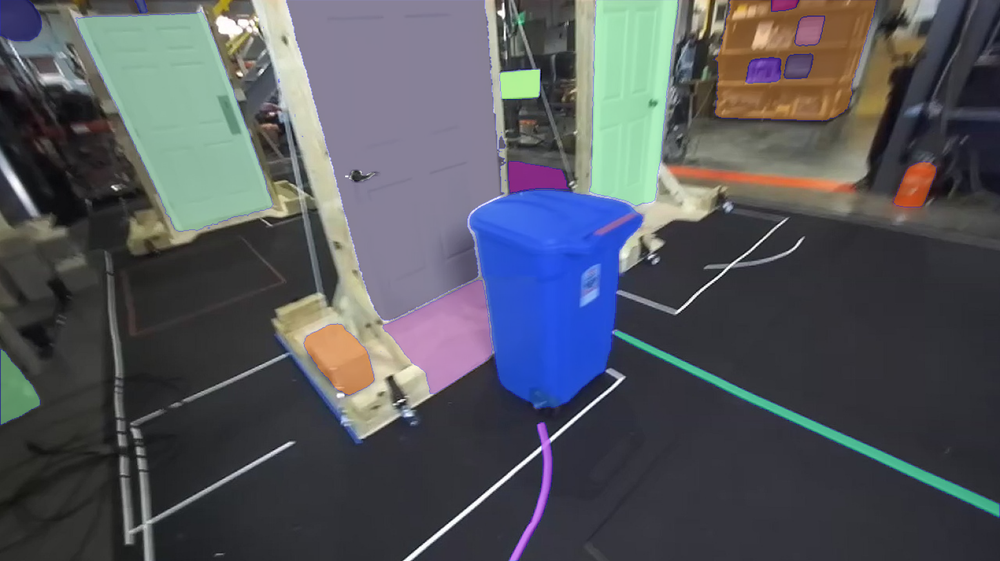
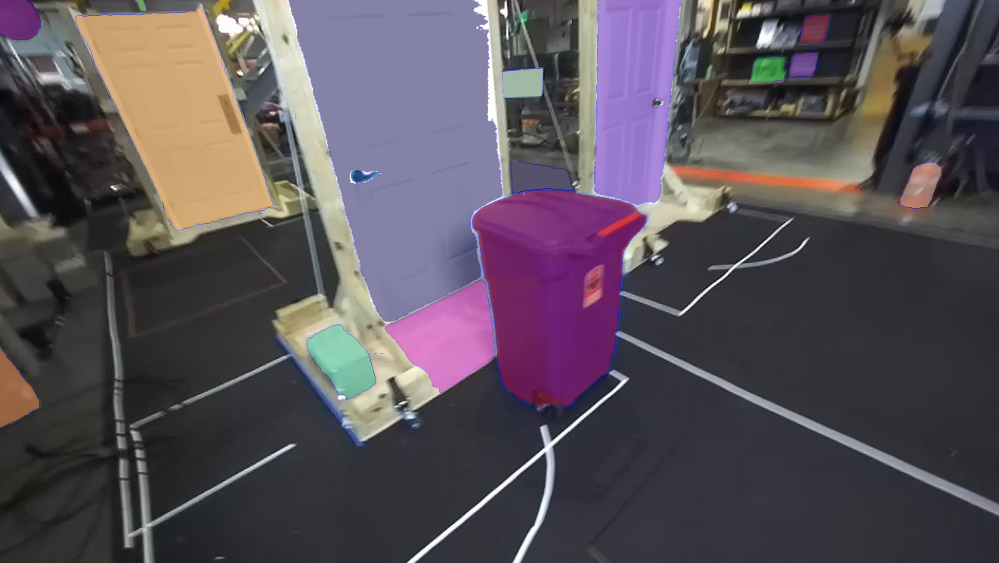
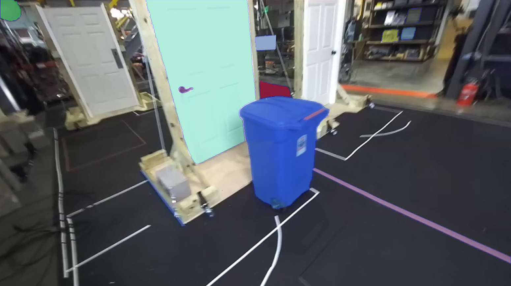

# SAM 2: Segment Anything in Images and Videos

**Segment Anything Model 2 (SAM 2)** is a foundation model towards solving promptable visual segmentation in images and videos. We extend SAM to video by considering images as a video with a single frame. The model design is a simple transformer architecture with streaming memory for real-time video processing. We build a model-in-the-loop data engine, which improves model and data via user interaction.

## Platform
Python 3.10 with PyTorch 2.3.1 (or higher) and cuda 12.1 has been used in this tutorial. 

## Installation

SAM 2 needs to be installed first before use. The code requires `python>=3.10`, as well as `torch>=2.3.1` and `torchvision>=0.18.1`. Please follow the instructions [here](https://pytorch.org/get-started/locally/) to install both PyTorch and TorchVision dependencies. You can install SAM 2 on a GPU machine using:

```bash
git clone https://github.com/ArghyaChatterjee/segment-anything-2.git
cd segment-anything-2
python3 -m venv sam2_venv
source sam2_venv/bin/activate
pip3 install --upgrade pip
pip3 install -e .
pip3 install matplotlib opencv-python
```
Optinally, for Jupyter notebook examples, install the jupyter notebook inside the venv.
```bash
pip3 install jupyter
python3 -m ipykernel install --user --name=sam2_venv --display-name "Python (sam2_venv)"
cd notebooks
jupyter notebook
```
## Download Checkpoints

All the model checkpoints can be downloaded by running:

```bash
cd checkpoints
./download_ckpts.sh
```

## Image Inference
If you want to display the image once inferred with SAM2:
```bash
cd scripts
python3 image_seg_and_display.py
```

If you want to save the image once inferred with SAM2:
```bash
cd scripts
python3 image_seg_and_save.py
```

<table>
  <tr>
    <td></td>
    <td></td>
  </tr>
  <tr>
    <td></td>
    <td></td>
  </tr>
</table>

<table>
  <tr>
    <td>
      <figure>
        
        <figcaption>sam2_b+</figcaption>
      </figure>
    </td>
    <td>
      <figure>
        
        <figcaption>sam2_l</figcaption>
      </figure>
    </td>
  </tr>
  <tr>
    <td>
      <figure>
        
        <figcaption>sam2_s</figcaption>
      </figure>
    </td>
    <td>
      <figure>
        
        <figcaption>sam2_t</figcaption>
      </figure>
    </td>
  </tr>
</table>


### Image prediction

SAM 2 has all the capabilities of [SAM](https://github.com/facebookresearch/segment-anything) on static images, and we provide image prediction APIs that closely resemble SAM for image use cases. The `SAM2ImagePredictor` class has an easy interface for image prompting.

```python
import torch
from sam2.build_sam import build_sam2
from sam2.sam2_image_predictor import SAM2ImagePredictor

checkpoint = "./checkpoints/sam2_hiera_large.pt"
model_cfg = "sam2_hiera_l.yaml"
predictor = SAM2ImagePredictor(build_sam2(model_cfg, checkpoint))

with torch.inference_mode(), torch.autocast("cuda", dtype=torch.bfloat16):
    predictor.set_image(<your_image>)
    masks, _, _ = predictor.predict(<input_prompts>)
```

Please refer to the examples in [image_predictor_example.ipynb](./notebooks/image_predictor_example.ipynb) for static image use cases.

SAM 2 also supports automatic mask generation on images just like SAM. Please see [automatic_mask_generator_example.ipynb](./notebooks/automatic_mask_generator_example.ipynb) for automatic mask generation in images.

### Video prediction

For promptable segmentation and tracking in videos, we provide a video predictor with APIs for example to add prompts and propagate masklets throughout a video. SAM 2 supports video inference on multiple objects and uses an inference state to keep track of the interactions in each video.

```python
import torch
from sam2.build_sam import build_sam2_video_predictor

checkpoint = "./checkpoints/sam2_hiera_large.pt"
model_cfg = "sam2_hiera_l.yaml"
predictor = build_sam2_video_predictor(model_cfg, checkpoint)

with torch.inference_mode(), torch.autocast("cuda", dtype=torch.bfloat16):
    state = predictor.init_state(<your_video>)

    # add new prompts and instantly get the output on the same frame
    frame_idx, object_ids, masks = predictor.add_new_points(state, <your_prompts>):

    # propagate the prompts to get masklets throughout the video
    for frame_idx, object_ids, masks in predictor.propagate_in_video(state):
        ...
```

Please refer to the examples in [video_predictor_example.ipynb](./notebooks/video_predictor_example.ipynb) for details on how to add prompts, make refinements, and track multiple objects in videos.

## Model Description

|      **Model**       | **Size (M)** |    **Speed (FPS)**     | **SA-V test (J&F)** | **MOSE val (J&F)** | **LVOS v2 (J&F)** |
| :------------------: | :----------: | :--------------------: | :-----------------: | :----------------: | :---------------: |
|   sam2_hiera_tiny    |     38.9     |          47.2          |        75.0         |        70.9        |       75.3        |
|   sam2_hiera_small   |      46      | 43.3 (53.0 compiled\*) |        74.9         |        71.5        |       76.4        |
| sam2_hiera_base_plus |     80.8     | 34.8 (43.8 compiled\*) |        74.7         |        72.8        |       75.8        |
|   sam2_hiera_large   |    224.4     | 24.2 (30.2 compiled\*) |        76.0         |        74.6        |       79.8        |

\* Compile the model by setting `compile_image_encoder: True` in the config.


